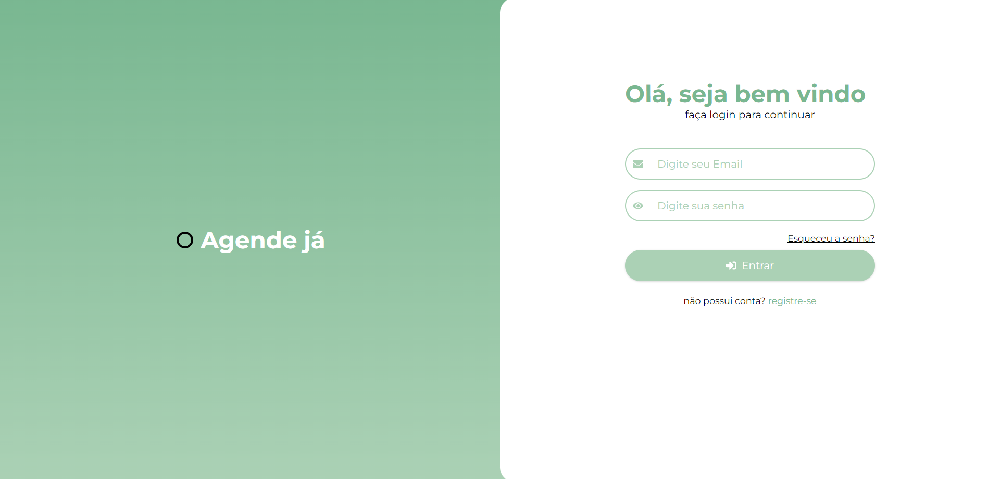
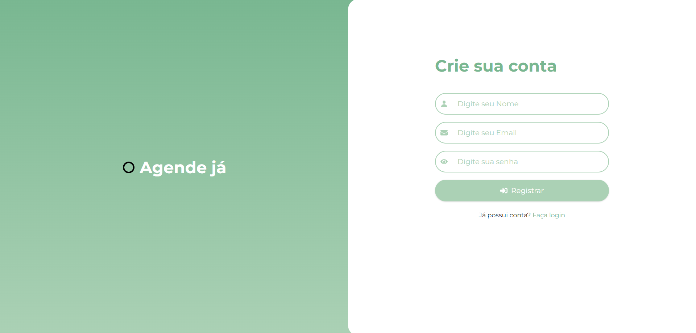
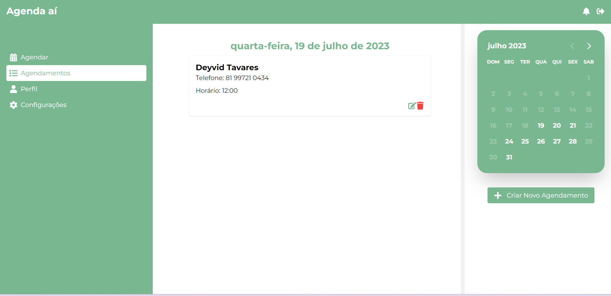
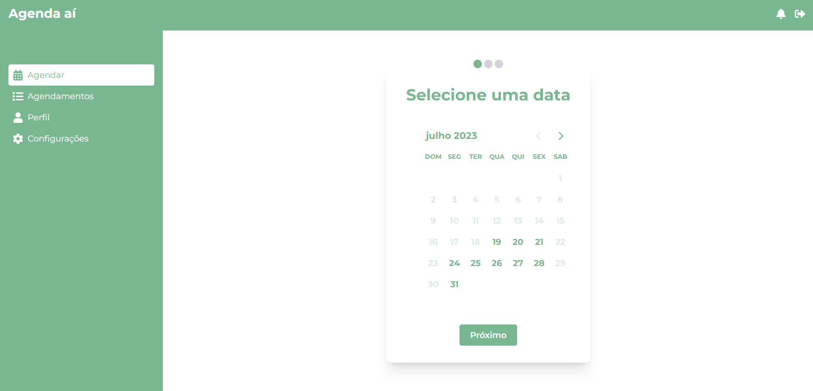
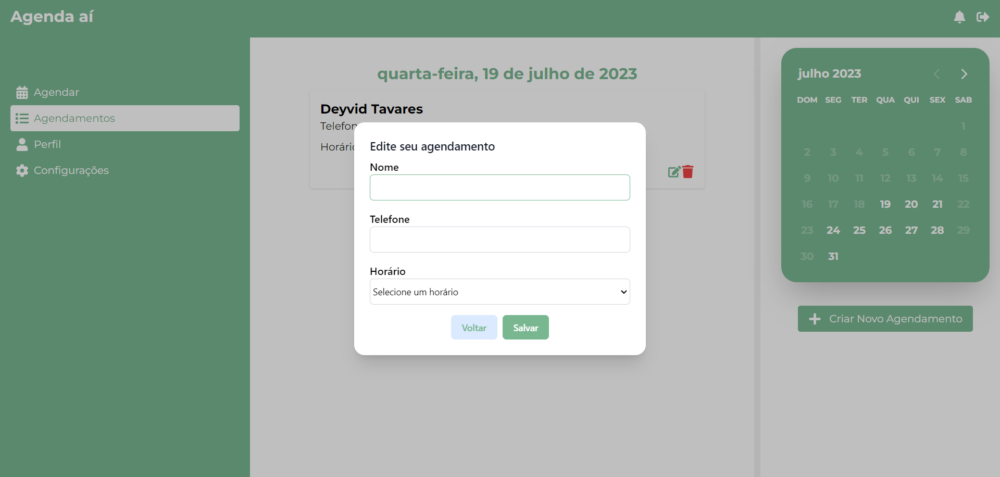
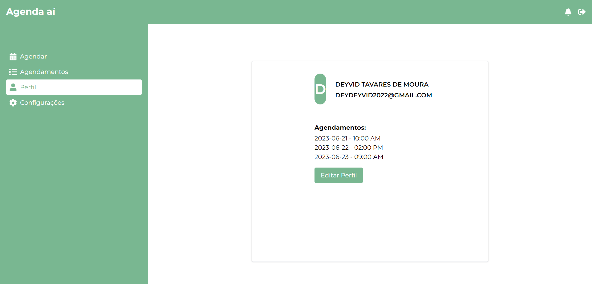

# Agenda 📅

Um projeto front-end para treinar soluções de agendamento com datas e CRUD.

## Tecnologias Utilizadas

- HTML
- CSS
- JavaScript
- Next.js
- React
- React Icons
- React Day Picker
- React Hook Form
- Tailwind CSS
- TypeScript
- E outras bibliotecas listadas no arquivo `package.json`

## Pré-requisitos

Antes de executar o projeto, certifique-se de ter as seguintes dependências instaladas:

- Node.js
- npm (gerenciador de pacotes do Node.js)

## Instalação

1. Clone e execute a API desenvolvida para esse projeto, use a documentação da mesma para instalar as dependências e configurar o setup:
```bash
git clone https://github.com/DevDeyvidTav/api-solid-agendamentos
```
2. Clone este repositório:
```bash
git clone https://github.com/DevDeyvidTav/front-agendamentos
```

3. Instale as dependências:
```bash
cd front-agendamentos
npm install
```

## Utilização

1. Execute a aplicação no seu terminal
```bash
npm run dev
```
## Funcionalidades Principais

<ul>
  <li>Autenticação de usuários com JWT 🔒</li>
  <li>Registro de usuários 📝</li>
  <li>Edição de usuário autenticado ✏️</li>
  <li>Obtenção de usuário por ID no banco de dados 🔍</li>
  <li>Agendamento de horários com formulário de 3 etapas 🗓️</li>
  <li>Edição e exclusão de agendamentos ✏️❌</li>
  <li>Listagem de agendamentos por usuário 🗒️</li>
  <li>Utilização de React Day Picker para seleção de datas 📅</li>
  <li>Utilização de date-fns para formatação de datas e horários 🕒</li>
  
</ul>

## Telas
### Tela de Login


### Tela de Registro


### Lista de Agendamentos por Usuário


### Criar Agendamento


### Editar Agendamento


### Perfil de Usuário


## Contribuição
Você pode contribuir com o projeto enviando uma issue para relatar problemas ou sugerir novas features. Também pode entrar em contato através do email devdeyvid2022@gmail.com. 🤝

## Autor
Este projeto foi desenvolvido por Deyvid Tavares. 👨‍💻

## Licença
Este projeto não possui uma licença específica no momento. 📜
